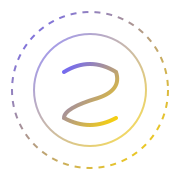

<div align="center">



<br/>

# ⚡ SHOUKAN LABS

### *We Summon Digital Power*

<p>
  
  
  
  
</p>

<p><em>Software sorcery, forged in code.<br/>Custom software, cloud security, and offensive testing — built for teams who demand precision.</em></p>

[](https://shoukan-labs.vercel.app)
[](mailto:yarkhan025@gmail.com)

</div>

---

## 🔮 Who We Are

Shoukan Labs brings software visions to life — **built with precision, armored with security, charged with performance.**

We design and build premium digital systems for ambitious teams who want speed, resilience, and clarity. Whether you're building from scratch, hardening what you have, or need someone to attack your systems before attackers do — we've been summoned for exactly that.

> *"Shoukan" (召喚) means summoning. Every project is a conjuring — drawing something powerful from nothing.*

---

## 🧿 What We Conjure

| Service | Description |
|---|---|
|  **Custom Software Development** | Tailored web and software applications — scalable, fast, and built to last |
|  **Website Refinement & Optimization** | Performance, UX, and visual polish that transforms existing sites |
|  **Cloud Infrastructure & Security** | Architecture and hardening across AWS, GCP, and Azure |
|  **Penetration Testing** | Full-scope ethical hacking with detailed, actionable reporting |
|  **Security Auditing** | Code reviews, vulnerability analysis, and compliance alignment |
|  **API & Systems Integration** | Secure, reliable integrations across your entire ecosystem |

---

## 🔄 The Summoning Ritual

Our process is deliberate, transparent, and relentless.

```
  DISCOVERY      →  Deep consultation on goals, systems, and constraints
  SPELLCRAFTING  →  Architecture and design tailored to your exact needs  
  CONJURING      →  Development or assessment with full transparency
  FORTIFICATION  →  Testing, hardening, and quality assurance at every layer
  UNLEASHING     →  Deployment, handoff, documentation, and ongoing support
```

---

## 🛡️ Security Pillars

```
┌─────────────────────────────────────────────────────────────────┐
│  🔴  OFFENSIVE TESTING      Pentest · Red Teaming · OSINT       │
│  🔵  DEFENSIVE ARCHITECTURE Secure-by-design infra & hardening  │
│  🟡  COMPLIANCE & REPORTING OWASP · CVSS scoring · Remediation  │
└─────────────────────────────────────────────────────────────────┘
```

---

## ⚔️ Our Arsenal

<div align="center">


</div>

---

## 📊 Proof of Power

<div align="center">

| 🔮 | ✅ | 🔒 | 🗡️ |
|:---:|:---:|:---:|:---:|
| **150+** | **98%** | **0** | **5+** |
| Projects Summoned | Client Satisfaction | Critical Breaches Post-Audit | Years of Dark Arts |

</div>

---

## 💬 Voices from the Realm

> *"They didn't just build our platform — they fortified it. The pentest report alone was worth twice what we paid."*
>
> **— Aria Voss**, Nyx Labs

> *"Shoukan refactored our app and our security posture in a single engagement. The work feels conjured, not coded."*
>
> **— Marcus Chen**, Helios Cloud

> *"Elite craftsmanship. They speak the language of attackers and architects with equal fluency."*
>
> **— Sana Rahimi**, Obsidian Health

---

## 📬 Summon the Team

Ready to conjure something extraordinary?

| Channel | Link |
|---|---|
|  **Website** | [shoukan-labs.vercel.app](https://shoukan-labs.vercel.app) |
|  **Email** | [yarkhan025@gmail.com](mailto:yarkhan025@gmail.com) |

Reach out for a **free audit** or **project estimate** — we'll schedule a discovery call and take it from there.

---

<div align="center">

<sub>⚡ Built with dark arts by Shoukan Labs · *Summoning Digital Excellence*</sub>

</div>
